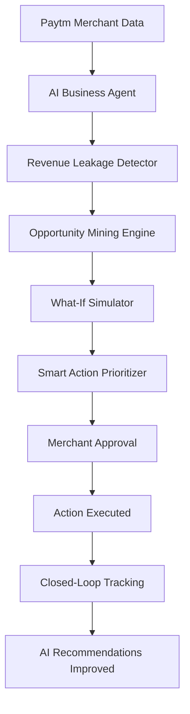
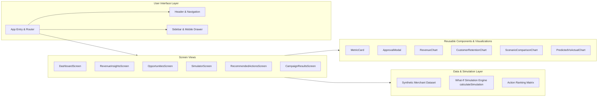

# Paytm VyaparMitra AI

> "Your AI Business Partner for Smarter Merchant Growth"

**Paytm VyaparMitra AI** is an AI-powered Merchant Growth Copilot prototype developed for the **Paytm Build for India AI Hackathon** under the **Merchant Growth AI** track.

Small offline and retail merchants process hundreds of UPI and card transactions daily through Paytm QR soundboxes and POS terminals, but rarely have the time, tools, or business expertise to extract actionable intelligence from that data. Paytm VyaparMitra AI demonstrates how an AI agent can step beyond passive transaction logging to actively monitor merchant health, diagnose revenue leakage, discover untapped growth opportunities, simulate business decisions through a What-If engine, prioritize high-leverage actions with human-in-the-loop consent, and track outcomes in a closed feedback loop.

*Note: This repository contains an interactive frontend prototype built using synthetic merchant data (featuring the fictional persona "Aarav Café" in Noida) to showcase the end-to-end agentic workflow without exposing real customer or banking information.*

---

## 2. Overview

Paytm VyaparMitra AI is designed as an intelligent business copilot for small-and-medium merchants (kiranas, cafés, restaurants, salons, and retail outlets).

- **What it does:** Automatically analyzes transaction trends, flags business risks (like drop-offs in repeat customer frequency), formulates tailored growth opportunities, allows merchants to simulate the financial outcome of discounts before spending money, and suggests the highest-ROI action to take next.
- **Who it is built for:** Everyday Indian merchants who operate on tight margins, lack dedicated marketing or business analytics teams, and need clear, plain-language guidance rather than complex business intelligence dashboards.
- **What business problem it solves:** Bridges the gap between **raw payment transactions** and **informed business decisions**, preventing silent revenue leakage and avoiding unprofitable promotional campaigns.
- **Why merchants need an AI copilot:** While large enterprises have business intelligence teams, small business owners make decisions based on intuition. An AI business copilot levels the playing field by turning payment logs into continuous, actionable growth strategies.

---

## 3. Problem Statement

Small merchants generate valuable transaction logs every day through UPI QR codes and POS machines, but face persistent operational bottlenecks:

1. **Undetected Revenue Declines:** Merchants realize sales dropped only at month-end when reviewing bank accounts, making it too late to intervene.
2. **Invisible Customer Inactivity:** Regular patrons quietly stop visiting, but without automated customer lifecycle tracking, merchants cannot detect who became inactive or when.
3. **Uncertain Growth Potential:** Business owners struggle to pinpoint which specific dayparts (e.g., slow afternoon hours) or product pairings (e.g., coffee plus evening snacks) hold untapped revenue.
4. **Fear of Discount Miscalculation:** Merchants hesitate to run promotions because they cannot evaluate if a 10% or 15% discount will bring profitable incremental footfall or simply erode margins.
5. **Decision Paralysis:** With limited time and capital, merchants do not know which business task to tackle first.

---

## 4. Solution

Paytm VyaparMitra AI transforms everyday payment records into a proactive, closed-loop growth cycle:

```text
Merchant Data
     ↓
AI Business Understanding
     ↓
Revenue Leakage Detection
     ↓
Opportunity Mining
     ↓
What-If Simulation
     ↓
Smart Action Prioritization
     ↓
Merchant Approval (Human-in-the-Loop)
     ↓
Action Execution
     ↓
Result Tracking
     ↓
Improved Recommendations
```

Instead of overwhelming merchants with raw numbers, VyaparMitra AI explains **what is happening**, **why it matters**, and **what specific action to take next**, ensuring the merchant remains the ultimate decision-maker.

---

## 5. Core Features

### 1. Revenue Leakage Detector
Continuously evaluates historical transaction volume and repeat customer frequencies against baseline performance.
- Identifies critical drops in customer retention (e.g., repeat rate falling from 86% to 68%).
- Quantifies exact audience counts (e.g., 420 regular patrons inactive for 3+ weeks).
- Estimates monthly revenue at risk (e.g., ₹18,000/month) with associated confidence scoring.

### 2. Opportunity Mining Engine
Discovers growth vectors hidden inside day-to-day sales and footfall patterns:
- **Retention Recovery (Primary):** Re-engaging 420 inactive regulars with targeted incentives.
- **Basket Size Expansion:** Pairing high-velocity items (evening coffee) with complementary snacks between 5 PM and 8 PM (potential: ₹10,000).
- **Capacity Utilization:** Stimulating quiet off-peak hours (4 PM to 6 PM) with limited-window promotions (potential: ₹6,500).

### 3. What-If Simulator
An interactive decision sandbox where merchants test strategies before committing money:
- **Interactive Discount Slider:** Adjust incentive levels from 0% to 20% (default: 10%).
- **Dynamic Forecasting:** Computes expected customer recovery ranges (120–150 customers at 10%), additional revenue (+₹18,000), campaign costs (₹4,500), and projected net profit impact.
- **Risk Assessment:** Evaluates risk levels (Low, Medium, High) to protect operating margins from discount erosion.
- **Scenario Benchmark:** Directly compares "No Offer", "5% Offer", and "10% Offer" side-by-side.

### 4. Smart Action Prioritizer
Ranks candidate business initiatives using an objective decision model:
- **Weighted Formula:** Evaluates Expected Impact, Urgency, Implementation Effort, Statistical Confidence, and Business Risk.
- **Clear Priority Tiers:** High (Launch targeted retention offer), Medium (Evening combo promotion), and Low (Clear slow-moving inventory).
- **Human-in-the-Loop Consent:** Prompts the merchant with a confirmation modal detailing expected ROI, audience size, and cost before launching.

### 5. Closed-Loop Growth Tracking
Tracks actual campaign performance against the simulator's predictions:
- **Lifecycle Pipeline:** 5-step visual tracking from initial prediction to model recalibration.
- **Performance KPIs:** Validates recovered customer counts (138 actual vs 120–150 projected), additional revenue generated (₹16,500), and prediction accuracy (92%).
- **AI Feedback Recalibration:** Explains how the model learns from actual outcomes (e.g., updating price elasticity coefficients for weekend morning beverage traffic).

---

## 6. Product Workflow



### Workflow Explanation
1. **Paytm Merchant Data:** Ingests UPI and POS transaction history, repeat patron frequencies, and peak-hour timelines.
2. **AI Business Agent:** Normalizes trends against past baselines to understand the merchant's business context.
3. **Revenue Leakage Detector:** Flags abnormal performance dips and quantifies revenue at risk.
4. **Opportunity Mining Engine:** Formulates targeted commercial opportunities to recover or expand revenue.
5. **What-If Simulator:** Computes expected outcomes across customizable parameters (discounts, audience size, timing).
6. **Smart Action Prioritizer:** Ranks potential initiatives using impact, effort, and confidence weighting.
7. **Merchant Approval:** Human-in-the-loop confirmation modal ensures the merchant retains full business control.
8. **Action Executed:** Triggers promotional delivery (e.g., Paytm Consumer App push / SMS voucher).
9. **Closed-Loop Tracking:** Measures real-world footfall and revenue lift against predicted benchmarks.
10. **AI Recommendations Improved:** Feeds outcome metrics back into the simulation engine to refine future predictions.

---

## 7. Agentic AI Architecture

VyaparMitra AI operates as a **Merchant Growth Agent / AI Business Copilot**:

```text
┌────────────────────────────────────────────────────────────┐
│                    MERCHANT GROWTH AGENT                   │
│                                                            │
│  1. Observe        → Ingests daily transaction logs        │
│  2. Understand     → Maps business context & baseline      │
│  3. Detect         → Identifies retention drop-offs        │
│  4. Identify       → Mines high-potential opportunities    │
│  5. Simulate       → Models price elasticity & cost        │
│  6. Prioritize     → Ranks actions by net expected value   │
│  7. Request Consent→ Human-in-the-loop merchant approval   │
│  8. Track          → Measures real vs. predicted uplift    │
│  9. Recalibrate    → Updates weights for future advice     │
└────────────────────────────────────────────────────────────┘
```

### Human-in-the-Loop Safeguard
The agent **never executes autonomous financial actions or spends merchant capital unilaterally**. All promotional campaigns, discount rates, and customer communications require explicit merchant authorization via the built-in confirmation dialog.

---

## 8. System Architecture

The current implementation is structured as a modular, responsive Single-Page Application (SPA) with dedicated presentation, simulation, and state layers:



---

## 9. Technology Stack

The repository contains the following implemented technologies:

| Category | Technology | Version | Description |
| :--- | :--- | :--- | :--- |
| **Frontend Framework** | React | `^19.0.1` | Component-based UI library |
| **Language** | TypeScript | `~5.8.2` | Type-safe JavaScript superset |
| **Build Tool & Dev Server** | Vite | `^6.2.3` | Rapid build tooling and ESM development server |
| **Styling** | Tailwind CSS | `^4.1.14` | Utility-first CSS engine via `@tailwindcss/vite` |
| **Data Visualizations** | Recharts | `^3.10.1` | Composable SVG charting library for React |
| **Icons** | Lucide React | `^0.546.0` | Comprehensive vector icon set |
| **Animation Engine** | Motion | `^12.23.24` | Layout and micro-interaction animations |
| **Typography** | Plus Jakarta Sans & Space Grotesk | Google Fonts | Crisp modern display and UI fonts |

*(Note: While `@google/genai` and `express` are declared in `package.json` for server-side capability, the current hackathon prototype runs client-side using Vite and deterministic simulation logic.)*

---

## 10. Project Structure

```text
paytm-vyaparmitra-ai/
├── public/                     # Static public assets
├── src/
│   ├── components/             # Reusable UI elements
│   │   ├── charts/             # Recharts visualization wrappers
│   │   │   ├── CustomerRetentionChart.tsx  # Retention trend line chart
│   │   │   ├── PredictedVsActualChart.tsx  # Simulation vs actual bar chart
│   │   │   ├── RevenueChart.tsx            # 6-week revenue area chart
│   │   │   └── ScenarioComparisonChart.tsx # Multi-discount scenario chart
│   │   ├── ApprovalModal.tsx   # Human-in-the-loop confirmation modal
│   │   ├── Header.tsx          # Top navigation and brand banner
│   │   ├── MetricCard.tsx      # Standardized metric card with trend badges
│   │   └── Sidebar.tsx         # Collapsible desktop navigation bar
│   ├── data/
│   │   └── mockData.ts         # Synthetic merchant data and simulation math
│   ├── screens/                # Core product views
│   │   ├── CampaignResultsScreen.tsx    # Closed-loop tracking & learning
│   │   ├── DashboardScreen.tsx          # Main KPI overview & AI alert
│   │   ├── OpportunitiesScreen.tsx      # Growth opportunities list
│   │   ├── RecommendedActionsScreen.tsx # Action prioritization matrix
│   │   ├── RevenueInsightsScreen.tsx    # Diagnostic deep dive on leakage
│   │   └── SimulatorScreen.tsx          # Interactive What-If discount tool
│   ├── App.tsx                 # Root component with state-driven routing
│   ├── index.css               # Global styling and Tailwind imports
│   ├── main.tsx                # React DOM root mounting
│   └── types.ts                # TypeScript interfaces and data models
├── .env.example                # Template for environment configuration
├── .gitignore                  # Git untracked files specification
├── index.html                  # HTML entry point with metadata tags
├── metadata.json               # Application description and permissions
├── package.json                # Project dependencies and script definitions
├── tsconfig.json               # TypeScript compiler configuration
└── vite.config.ts              # Vite plugins and dev server settings
```

---

## 11. Installation and Setup

### Prerequisites
- **Node.js**: Version 18.0.0 or later (Node 20+ recommended)
- **npm**: Version 9.0.0 or later (or `bun` / `pnpm` / `yarn`)
- **Git**: Installed on your development machine

### Clone Repository
```bash
git clone https://github.com/your-username/paytm-vyaparmitra-ai.git
cd paytm-vyaparmitra-ai
```

### Install Dependencies
```bash
npm install
```

---

## 12. Environment Variables

The prototype runs out-of-the-box using synthetic merchant data. No external API keys or credentials are required to start and evaluate the application.

A reference `.env.example` file is provided for future integration phases:

```env
# GEMINI_API_KEY: Optional. For future live Gemini model grounding.
GEMINI_API_KEY="your_api_key_here"

# APP_URL: Optional. Base hosting URL for webhooks or self-referential links.
APP_URL="http://localhost:3000"
```

---

## 13. Running the Project Locally

### Start Development Server
```bash
npm run dev
```

The Vite development server starts bound to port `3000`:
- **Local URL:** [http://localhost:3000](http://localhost:3000)
- **Network URL:** `http://0.0.0.0:3000`

### Build for Production
```bash
npm run build
```
Generates static production assets in the `dist/` directory.

### Run Type Checking
```bash
npm run lint
```
Runs `tsc --noEmit` to validate TypeScript types.

---

## 14. How to Use the Application

Follow the complete end-to-end merchant journey:

1. **Merchant Dashboard (`/`):**
   - Review baseline metrics: Total Revenue (₹1,24,500), Growth (-8.4%), Repeat Customers (68%), and Revenue at Risk (₹18,000).
   - Read the prominent **AI Business Alert**: *"Your repeat customer rate has dropped by 18% this month; 420 regular customers have not returned in the last 3 weeks; ₹18,000/month at risk."*
   - Click **"View Revenue Insight"**.

2. **Revenue Leakage Detector (`/revenue-insights`):**
   - Inspect diagnostic cards comparing Last Month (86%) vs This Month (68%).
   - Review the weekly retention decline curve.
   - Click **"Find Growth Opportunities"**.

3. **Opportunity Center (`/opportunities`):**
   - Review the AI-mined opportunities, focusing on the primary recommendation: **"Recover Inactive Customers"** (Target: 420 regulars, Potential: ₹18,000).
   - Click **"Simulate This Opportunity"**.

4. **What-If Business Simulator (`/simulator`):**
   - Use the slider to adjust the promotional discount (0% to 20%).
   - Observe real-time recalculations of Recovered Customers, Estimated Revenue, Campaign Cost, Profit Impact, and Risk Level.
   - Compare the outcome against the benchmark chart.
   - Click **"Prioritize This Action"**.

5. **Smart Action Prioritizer (`/recommended-actions`):**
   - Review the AI-ranked decision matrix evaluating expected impact vs effort.
   - Locate the top action: *"Launch targeted retention offer first"*.
   - Click **"Approve and Track Campaign"**.
   - Confirm details in the **Human-in-the-Loop Approval Modal**.

6. **Closed-Loop Growth Tracking (`/campaign-results`):**
   - Review the 5-stage progress lifecycle.
   - Verify post-campaign metrics: 138 customers recovered, ₹16,500 additional revenue, 92% model accuracy.
   - Read the AI feedback card detailing model recalibration for subsequent recommendations.
   - Click **"Back to Dashboard"** to complete the loop.

---

## 15. Sample Merchant Scenario

To make the demonstration concrete, the prototype models a realistic Indian merchant context:

| Attribute | Value |
| :--- | :--- |
| **Merchant Name** | **Aarav Café** |
| **Category** | Small Café & Quick Bites |
| **Location** | Sector 62, Noida, Uttar Pradesh, India |
| **Terminal ID** | `PTM-NOI-88421` |
| **Paytm QR ID** | `paytmqr281005@paytm` |
| **Active Since** | March 2023 |
| **Current Observation** | Steady first-time visitors, but regular repeat footfall dropped from 86% to 68% |
| **Identified Leakage** | 420 regular customers inactive for >21 days |
| **Revenue at Risk** | ₹18,000 / month |
| **Tested Solution** | 7-day 10% targeted retention push to inactive regulars |
| **Simulation Output** | 120–150 customers recovered, ₹18,000 gross revenue, ₹4,500 cost |
| **Actual Measured Outcome** | 138 customers recovered, ₹16,500 net revenue, 92% prediction precision |

*Note: All figures and merchant identifiers are synthetic demonstration values constructed for evaluation.*

---

## 16. Screenshots / Demo

*Add your captured application screenshots to `docs/screenshots/` and link them below:*

### 1. Merchant Dashboard
<!--  -->
*Overview showing high-level KPIs, 6-week revenue area chart, and the critical AI Business Alert card.*

### 2. Revenue Leakage Detector
<!--  -->
*Comparative retention curve (Last Month vs This Month) and breakdown of the 420 inactive regulars.*

### 3. What-If Business Simulator
<!--  -->
*Interactive discount slider (0%–20%) with dynamic cost, profit, and customer recovery calculations.*

### 4. Smart Action Prioritizer & Approval Modal
<!--  -->
*Ranked decision matrix with human-in-the-loop merchant approval safeguard.*

### 5. Closed-Loop Growth Tracking
<!--  -->
*Predicted vs. actual performance charts and AI learning recalibration summary.*

---

## 17. Prototype and Hackathon Context

- **Event:** Paytm Build for India AI Hackathon
- **Track:** Merchant Growth AI
- **Vision:** Showcases how Paytm's merchant ecosystem can evolve from a **passive payment acceptance utility** (QR codes, soundboxes, card POS) into an **active growth engine**. By augmenting merchants with proactive intelligence, Paytm helps merchants grow their bottom line, driving higher transaction volumes and merchant loyalty across the network.

---

## 18. Current Status

| Feature / Capability | Status | Implementation Details |
| :--- | :---: | :--- |
| **Merchant Growth Dashboard** | **Implemented** | Interactive KPIs, 6-week revenue chart, retention comparison, AI alert card |
| **Revenue Leakage Detector** | **Implemented** | Multi-card diagnosis, weekly retention decline tracking, root-cause narrative |
| **Opportunity Mining Engine** | **Implemented** | 3 prioritized business opportunities with ROI, confidence, and effort scoring |
| **What-If Business Simulator** | **Implemented** | Interactive 0%–20% slider, dynamic simulation formulas, scenario comparison |
| **Smart Action Prioritizer** | **Implemented** | Multi-factor prioritization table with High/Med/Low ratings |
| **Human-in-the-Loop Approval** | **Implemented** | Modal dialog requiring explicit merchant consent before campaign launch |
| **Closed-Loop Result Tracking** | **Implemented** | Predicted vs. actual comparison charts and AI learning feedback panel |
| **State & Route Navigation** | **Implemented** | Browser history + hash-backed SPA navigation with mobile slide-over drawer |
| **Live Paytm Merchant APIs** | **Planned / Future Scope** | Direct OAuth ingestion from production Paytm Merchant Services |
| **Direct SMS / WhatsApp Push** | **Planned / Future Scope** | Automated dispatch of consumer vouchers via Paytm marketing rails |
| **Multi-Store Aggregation** | **Planned / Future Scope** | Multi-outlet analytics for franchise merchants |

---

## 19. Future Scope

1. **Production Paytm Merchant API Integration:** Securely bind live QR payment feeds, settlement batches, and Soundbox voice notification logs.
2. **Automated Campaign Execution:** Integrate with Paytm Consumer App marketing channels (vouchers, scratch cards, geofenced notifications) upon merchant approval.
3. **Multi-Category Business Models:** Expand domain-specific heuristics to pharmacies, grocery/kirana stores, electronics, and apparel.
4. **Multilingual Voice & Chat Interface:** Support Soundbox-style voice interaction in Hindi, Tamil, Telugu, Kannada, Bengali, and Marathi for non-English-speaking shop owners.
5. **Continuous Model Learning:** Deploy server-side reinforcement learning to dynamically fine-tune price elasticity models per micro-market.

---

## 20. Security and Data Disclaimer

- **Synthetic Data Notice:** This prototype uses synthetic merchant records for Aarav Café. No real customer names, phone numbers, UPI VPI addresses, or bank account credentials are stored or processed.
- **Credential Hygiene:** Never commit production API keys, secrets, or certificates into git repositories. All configuration must remain in `.env` files.
- **Strict Human Oversight:** The AI agent is designed strictly as a decision-support copilot. It does not possess autonomous authority to transfer funds, debit balances, or initiate promotional expenditures without explicit merchant consent.

---

## 21. License

License information to be added.

---

## 22. Author and Acknowledgements

- **Project:** Paytm VyaparMitra AI
- **Built for:** Paytm Build for India AI Hackathon
- **Track:** Merchant Growth AI
- **Special Thanks:** Paytm engineering, product, and developer communities for the developer tools and problem statements inspiring merchant enablement across India.
